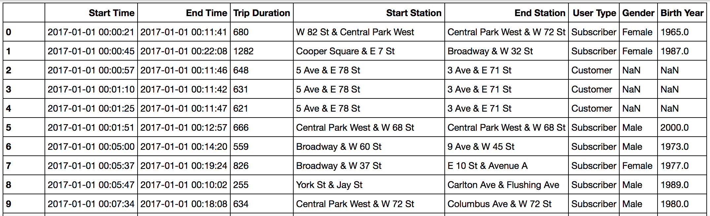

### Date Created
#### 28-Sep-2024

### Project Title
#### Explore US Bikeshare Data

### Description
#### **Bike Share Data**
> Over the past decade, bicycle-sharing systems have been growing in number and popularity in cities across the world. Bicycle-sharing systems allow users to rent bicycles on a very short-term basis for a price. This allows people to borrow a bike from point A and return it at point B, though they can also return it to the same location if they'd like to just go for a ride. Regardless, each bike can serve several users per day.
> Thanks to the rise in information technologies, it is easy for a user of the system to access a dock within the system to unlock or return bicycles. These technologies also provide a wealth of data that can be used to explore how these bike-sharing systems are used.
> In this project, you will use data provided by [Motivate(**opens in a new tab)**](https://www.motivateco.com/), a bike share system provider for many major cities in the United States, to uncover bike share usage patterns. You will compare the system usage between three large cities: Chicago, New York City, and Washington, DC.

#### **The Datasets**
Randomly selected data for the first six months of 2017 are provided for all three cities. All three of the data files contain the same core **six (6)** columns:
* Start Time (e.g., 2017-01-01 00:07:57)
* End Time (e.g., 2017-01-01 00:20:53)
* Trip Duration (in seconds - e.g., 776)
* Start Station (e.g., Broadway & Barry Ave)
* End Station (e.g., Sedgwick St & North Ave)
* User Type (Subscriber or Customer)

The Chicago and New York City files also have the following two columns:
* Gender
* Birth Year

*Data for the first 10 rides in the new_york_city.csv file*

> The original files are much larger and messier, and you don't need to download them, but they can be accessed here if you'd like to see them ([Chicago(opens in a new tab)](https://www.divvybikes.com/system-data), [New York City(opens in a new tab)](https://www.citibikenyc.com/system-data), [Washington(opens in a new tab)](https://www.capitalbikeshare.com/system-data)). These files had more columns and they differed in format in many cases. Some [data wrangling(opens in a new tab)](https://en.wikipedia.org/wiki/Data_wrangling) has been performed to condense these files to the above core six columns to make your analysis and the evaluation of your Python skills more straightforward.

#### Statistics Computed
> You will learn about bike share use in Chicago, New York City, and Washington by computing a variety of descriptive statistics. In this project, you'll write code to provide the following information:

**#1 Popular times of travel** (i.e., occurs most often in the start time)
- most common month
- most common day of week
- most common hour of day

**#2 Popular stations and trip**
- most common start station
- most common end station
- most common trip from start to end (i.e., most frequent combination of start station and end station)

**#3 Trip duration**
- total travel time
- average travel time

**#4 User info**
- counts of each user type
- counts of each gender (only available for NYC and Chicago)
- earliest, most recent, most common year of birth (only available for NYC and Chicago)

#### Files used
> pdsnd_github\
> +-- bikeshare.py\
> +-- chicago.csv\
> +-- new_york_city.csv\
> +-- washington.csv\
> +-- image\
> |     +-- README\
> |         +-- 1727508512724.png\
>+-- README.md

### Credits
> Udacity Nanodgree - Programming for Data Science with Python